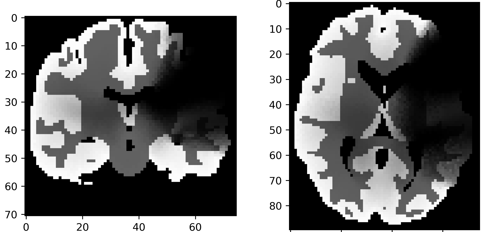
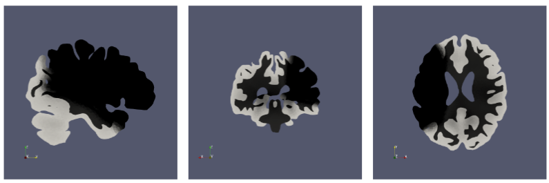

Project structure
=================

The following graph shows the project directory structure. All files are not displayed as this is a large project.
However, each folder contains a ``README.md`` file to explain its content.

.. code-block:: text

    ├── perfusion/
    │   ├── containers/
    │   │   ├── container.def
    │   │   └── container.sif
    │   ├── boundary_data/
    │   │   ├── templates/
    │   │   └── BC.csv
    │   ├── brain_meshes/
    │   │   └── ...
    │   ├── configs/
    │   │   ├── config_examples/
    │   │   └── ...
    │   ├── hpc_submission/
    │   │   ├── Crescent2/
    │   │   │   └── ...
    │   │   └── Ares/
    │   │   │   └── ...
    │   ├── results/
    │   │   └── ... # All the results files
    │   ├── src/
    │   │   ├── Legacy_version/
    │   │   │   ├── io/
    │   │   │   ├── simulation/
    │   │   │   └── utils/
    │   │   └── X_version/
    │   │   │   ├── io/
    │   │   │   ├── plotter/
    │   │   │   ├── optimisation/
    │   │   │   ├── simulation/
    │   │   │   └── utils/
    │   ├── test/
    │   │   └── ...
    │   ├── verification/
    │   │   └── ...
    │   ├── README.md
    │   └── perfusion_runner.sh
    └── docs/
        └── ...

Folder explanation
==================

Perfusion folder
-----------------

This folder contains the code related to the perfusion model, which describe the amount of blood delivered to a given
amount of tissue in a given time (unit describing the perfusion: [ml/min/100g]). This code is structured clearly into
different folders according to the functions of the file.

This folder also contains a ``README.md`` file and a runner, called perfusion_runner.sh, that runs the typical workflow
of the perfusion simulations.

Containers folder
^^^^^^^^^^^^^^^^^

The containers folder groups both ``.def`` and ``.sif`` files related to the containers of the project.
The ``.sif`` file is supposed to be here when the container has been built.
The container definition specifies two conda environments, one for FEniCS Legacy and another for FEniCS X.
The environment for FEniCS Legacy is built using the ``environment.yaml`` file. It is a files that specifies the
dependencies for the conda environment.

Boundary Data folder
^^^^^^^^^^^^^^^^^^^^

This folder contains the boundary conditions of the brain mesh used for the simulation. A template is available,
or a new file could be generated using the the ``BC_creator.py`` file.

Brain meshes folder
^^^^^^^^^^^^^^^^^^^

This folder contains the description of the brain meshes used for the simulation.

Configs folder
^^^^^^^^^^^^^^

This folder contains the configurations files with the extension ``.yaml``, and a folder gathering some examples of
configurations for the simulations.
A typical configuration file contains data for the input and the output of the simulation, the physical parameters such
as the arterial pressure, the simulation parameters such as the velocity order, and finally the optimisation parameters
such as the parameters which are optimised.
Below is an example for the ``permeability_initialiser.py`` simulation, which initialises the permeability tensor.

.. code-block:: yaml

    input:
        # xdmf file refering to a tetrahedral mesh with labelled boundaries and subdomains
        mesh_file: './brain_meshes/b0000/clustered.xdmf'
    output:
        # folder for results
        res_fldr: './brain_meshes/b0000/permeability/'
        # save sub-results
        save_subres: false
        res_vars: {'K1_form'}
    physical:
        # normal vector of the cortical surface in the reference coordinate system
        e_ref: [0, 0, 1]
        # arteriole/venule permeability tensor form [row1, row2, row3]
        K1_form: [0, 0, 0, 0, 0, 0, 0, 0, 1]

HPC submission folder
^^^^^^^^^^^^^^^^^^^^^

This folder contains two sub-folders, Crescent2 and Ares, in which are gathered the submission files
for the HPC systems supported by the project.
The files are created for a serial or a parallel job of the different simulation and
run them inside a container imported into the HPC system.
The two HPC systems do not support the same workload manager and therefore, the submission files have different
structures.

Crescent2 works under the Portable Batch System (PBS) and the submission files contains the extension ``.sub``.
The structure of the files follows the template provided by Cranfield University.
A typical file contains a job name, the number of CPU/cores needed, the queue to run the job, the email of the user,
the loading of the correct module for the environment, the command to execute.

Ares relates on Slurm workload manager and the submission files have the extension ``.sh``.
As well as for PBS, the submission files contains information about the job name,
the number of CPUs used and the time limit - the queue in PBS.
It also has the output and error folders where the files are written after the job is finished.

Results
^^^^^^^

This folder is the output folder for the simulations.
The files are grouped by the simulation patient: usually healthy, LCMAo and RMCAo.
The results are produced with the extension ``.h5`` and ``.xdmf``.
The information gathered can be related to the pressure, the velocity or the perfusion in the brain.
An example for a LMCAo case is displayed in figure 1.

   Figure 1: Brain slices generated by simulation and visualised in Paraview in healthy (left) and LMCAo cases (right).

The results contain some ``.nii.gz`` files, which are the format used in the medical field for medical images.
It also contains ``.png`` photos which can be viewed easily.

   Figure 2: Photos extracted from the simulation in a LMCAo case in the ``.png`` format.

Finally, the results contains a ``perfusion_outcome.yaml`` which contains some data for the brain tissue
in the stroke case, a ``settings.yaml`` file that contains configuration settings,
and some ``.csv`` files that contains data about the simulation.

Src folder
^^^^^^^^^^

This folder contains two sub-folders, Legacy_version and X_version, related to the two versions of the FEniCS software.
The project is currently under a modernisation process that consists of switching from FEniCS Legacy to FEniCS-X.
Until now, the X version is not completely implemented and tested, we then decide to conserve the Legacy version in
order to always have a working version of the simulations available.

Both sub-folders are build with 3 folders:

* ``io``: it contains the resources related to the inputs and outputs of the simulations;
* ``simulation``: it contains the scripts of the simulations (i.e. basic_flow_solver.py);
* ``plotter``: it contains the scripts used to plot some results, such as the one displayed on figure 3;
* ``optimisation``: it contains the scripts which optimise the simulation parameters;
* ``utils``: it is a collection of useful resources.

   Figure 3: Results obtained for a LMCAo case with the Paraview slicer script.

Test folder
^^^^^^^^^^^

This folder contains the tests of the project, especially the unit tests.
They are classified in the same way as the source folder.
It also contains a script which creates a fixture for the tests.
It generates a simple cube slightly rotated with the ``mesh_file_generation.py``.

Verification
^^^^^^^^^^^^

This folder contains some initial integration tests.

Docs folder
-----------

This folder contains the source code of the Sphinx documentation of the project.