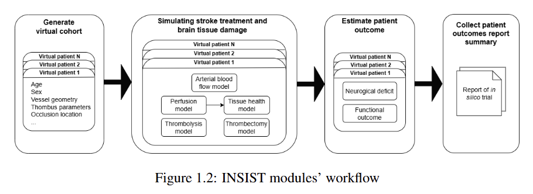

.. Gemini documentation master file, created by
   sphinx-quickstart on Thu Apr 24 14:36:49 2025.
   You can adapt this file completely to your liking, but it should at least
   contain the root `toctree` directive.

=====================
The perfusion project
=====================

The perfusion project is part of the **GEMINI** project, historically the **INSIST** project.

**GEMINI**, *Generation of Multi-scale Digital Twins of Ischaemic and Haemorrhagic Stroke Patients*, is a project that
aims at creating digital twins of stroke patients. It is a European project, funded by the European Union’s Horizon
Europe research and innovation programme.

Before Gemini, the perfusion project was part of the **INSIST** project, *IN-Silico trials for acute Ischaemic STroke*,
which seeks to model real-world clinical trials of Acute Ischaemic Stroke. A simple graph of the project structure is
available in figure 1. The perfusion model is included in the second module.

   Figure 1: INSIST modules’ workflow. The process begins with generating a virtual patient cohort based on demographic
   and anatomical data (e.g., age, sex, vessel geometry, thrombus characteristics). These virtual patients undergo
   stroke treatment simulations involving models of arterial blood flow, perfusion, tissue health thrombolysis and
   thrombectomy. Neurological deficits and functional recovery are then predicted. Finally, the results are aggregated
   into an in silico trial report summarizing patient outcomes.

Find more information about those project here:

* `GEMINI <https://dth-gemini.eu/>`_
* `INSIST <https://insist-h2020.eu/>`_

The perfusion model aims at simulating the blood flow in capillary vessel in healthy and stroke cases.
*Perfusion* refers to the amount of blood delivered to a given amount of tissue in a given time.
The associated unit is [ml/min/100g].

The GitHub repository of the project can be found `here <https://github.com/Gemini-DTH/perfusion_and_tissue_damage>`_.

.. toctree::
   :maxdepth: 2
   :hidden:

   files/ais
   files/background
   files/equations
   files/requirements
   files/local
   files/hpc
   files/container
   files/usage
   files/structure
   files/pipeline
   files/performance 
   files/IO_fcts
   files/finite_element_fcts
   files/suppl_fcts
